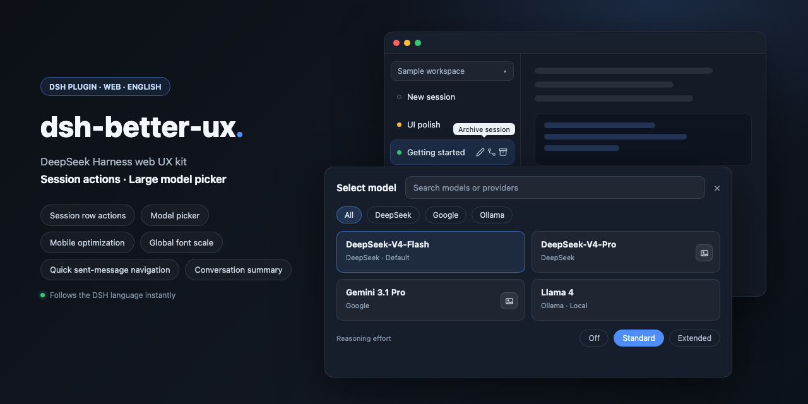
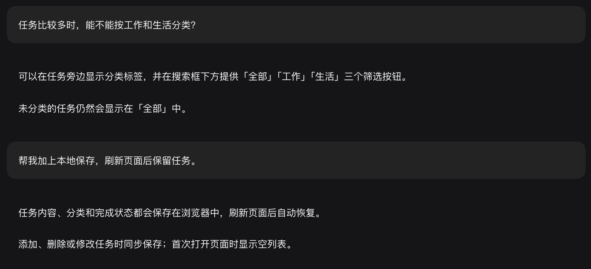

<div align="center">

<p>
  
</p>

# dsh-better-ux

**DeepSeek Harness web UX kit: session actions, model selection, mobile optimization, font scaling, sent-message navigation, conversation summaries, context reminders, and DeepSeek account status.**

<p>
  <b>🇺🇸 English</b> | <a href="README.md">🇨🇳 简体中文</a>
</p>

<p>
  <a href="https://github.com/deepseek-ai/deepseek-harness"></a>
  <a href="#install"></a>
  <a href="LICENSE"></a>
  <a href="https://www.npmjs.com/package/dsh-better-ux"></a>
</p>

<p>
  
</p>

</div>

A web UX kit for [DeepSeek Harness](https://github.com/deepseek-ai/deepseek-harness), with eight independently configurable interface improvements:

- **Session row actions** — hover idle, running, or newly activated sessions to show Rename / Fork; archive stays on the host row; keep `⋯` when another plugin adds menu actions
- **Model picker** — replace the cramped two-level menu with one overlay containing search, providers, reasoning levels, and Auto Vision twin actions on their original model cards
- **Mobile optimization** — hide the host sidebar on phones and tablets and render a custom horizontal bar; workspaces, sessions, status, overflow menus, view options, and sorting remain mapped to the host
- **Context reminder** — add used / total tokens to hover and turn the ring red at a configurable threshold, 90% by default
- **DeepSeek account status** — balance, peak/off-peak period, countdown, and input/output rates above the composer
- **Global font scale** — set independent 10%–200% ratios for font size, line height, and padding on mobile (phone/tablet) and desktop/other viewports; mobile defaults to 80%, and step buttons change the value by 5%
- **Quick sent-message navigation** — two floating buttons in the conversation jump to the previous or next message you sent; they show and hide together with the host Back to bottom button
- **Conversation summary** — off by default; pick a summary model and the session header gains a Conversation status panel holding a whole-conversation and a recent-task summary, cached locally and synced through the plugin's own host endpoint

All plugin-owned labels follow the current DSH language (Chinese or English) and update immediately when it changes. Mapped host actions reuse the host's localized labels where available. This release targets DSH builds with the built-in locale service.

### Model picker

One click opens a full overlay: search, provider chips, model cards, and reasoning levels on the bottom row. No nested “Model → list / Effort → list” menu. Providers stay on one horizontal rail; a normal mouse wheel or `Shift + wheel` scrolls it sideways, while independent `8px` fades indicate hidden content at either edge. If [dsh-vision-router](https://github.com/ysr666/dsh-vision-router) && [dsh-vision-router-inline](https://github.com/MitsukiJoe/dsh-vision-router-inline) are installed, Auto Vision twin providers are not shown as duplicate groups; they fold into the matching original model cards:
the card selects the original model, and the picture button on the right selects the vision route.

| Enabled (top) · Disabled, original menu (bottom) |
| --- |
|  |
|  |

### Session row actions

Idle, running, and blank sessions that finish activation all receive Rename and Fork shortcuts; hover an icon for its name. Archive uses the host session row's own button. The plugin hides the native `⋯` only when both shortcuts are enabled and the native menu contains exactly those two actions. Disabling any shortcut, an unrecognized menu, or extra actions contributed by another plugin keeps `⋯` available. This hiding rule is desktop-only and does not affect the mobile overflow menu.

| Enabled (top) · Disabled, original row (bottom) |
| --- |
|  |
|  |

### Mobile optimization

Under **Settings → Better UX**, phones and tablets hide the host sidebar and use the plugin's own top bar. The first row contains the logo, a conversation-header toggle, and native DSH actions for New session, New workspace, Search, View options, and Settings; the horizontal rows below show workspaces and sessions for the selected workspace.

**If you customized the original left sidebar heavily, consider turning this option off.**

- **Host mapping** — workspace/session selection, creation, search, Workspace/Flat grouping, Manual/Recently updated sorting, and overflow menus call host data and callbacks; selecting a workspace collapsed on desktop expands it without offering a mobile collapse action
- **Status and time** — each session uses one row ordered as status, title, time, and overflow action; approvals, plan reviews, and questions use a yellow dot, running keeps the host animated icon, completed-unread uses a green dot, and completed-read has no prefix
- **Adaptive title rows** — Chinese titles show up to `12` characters and English receives twice that budget before `...`; short titles shrink to their content, while workspace and session capsules stay at `260%` of the current text size
- **Conversation header** — a mobile-only button beside the logo smoothly collapses or expands the host conversation header; top action icons are `18px` while their touch targets remain larger
- **Long-press reorder** — long-press a workspace or session tab to pop up a small capsule beneath it with `‹` `›` buttons that nudge it one slot per tap; works in both Manual and Recently updated ordering (Recently updated still auto-bubbles recently updated sessions to the front)
- **No auto-focus on session switch** — on by default; switching sessions does not focus the composer input, so the touch keyboard does not jump up and cover the content you opened the conversation to check (such as a freshly generated code block); tap the field whenever you want to type
- **Horizontal overflow** — workspace and session rows support touch scrolling with independent `8px` fades on each edge of each row
- **Disable page pinch-zoom** — on by default, blocks two-finger pinch zooming so a stray second finger on mobile no longer warps the page into an odd zoom or broken layout; if you rely on system zoom, turn the option off and the gesture comes back
- **Flat list** — removes the workspace row and reduces both bar height and content offset
- **Compatibility and restore** — the host conversation header and right-sidebar controls remain positioned below the dynamic bar; disabling the feature restores the original host sidebar and composer

| Enabled | Disabled, original layout |
| --- | --- |
|  |  |

Grouping follows the host view options: **By workspace** keeps the workspace rail above sessions, **Flat list** removes it and shortens the bar.

| Enabled | Disabled, original layout |
| --- | --- |
|  |  |

#### Limit model names to 4 characters

Under **Settings → Better UX → Mobile optimization**, on by default. On phone/tablet layouts (viewports up to 1023px), model names show at most four characters followed by `…`; reasoning effort stays fully visible on the same line. Works with both the native picker and this plugin's picker. Turning this option or the Mobile optimization master switch off immediately restores the full name.


### Context reminder

On by default. Hovering the context ring adds the native used / total figure below its percentage, such as `~291K / 1M`. Set **Red warning threshold** to any integer from 1 to 100; the default is `90%`. The ring turns bright red when its displayed percentage reaches that threshold. The native click-to-open details stay unchanged. Turning this off restores the native ring and hover.


### DeepSeek account status

On by default, in the native slot above the composer. Queued messages appear above the bar; the bar paints above the queue frame where their edges overlap. Balance sits left; the right side shows peak/off-peak, input/output rates (`M tok`), then remaining hours/minutes. Peak uses a red upward arrow, off-peak a green downward arrow; rates share that color and the countdown stays gray. Turning it off removes the bar and stops balance requests.

**Indicator colors** offers Dark / Bright, defaulting to Dark (the original palette). Bright uses red `#fe395d` and green `#00d066` for the context ring, balance alert, and peak/off-peak prices.

**Low balance alert** defaults to `5.00` in the balance currency; amounts strictly below it turn red. **Playful peak/off-peak labels** is on by default and shows “Liang Wenfeng / Liang Wengu” (「梁文峰 / 梁文谷」 in Chinese); turning it off restores the regular labels.


The Host calls the [official balance endpoint](https://api-docs.deepseek.com/api/get-user-balance/) independently using the official DeepSeek provider credentials; API keys never reach the browser. The balance is shared across sessions; switching sessions neither clears it nor triggers another request. Visible pages refresh roughly once a minute and pause while hidden. The Host caches each account for 60 seconds and shares concurrent requests. Missing official credentials or failures change only the left-side message; tariff, prices, and countdown remain visible. Restart DSH Web after upgrading to load the new Host endpoint.

Peak/off-peak means the **official billing period**, not live server congestion. [Pricing rules](https://api-docs.deepseek.com/quick_start/pricing/) were checked on 2026-09-19: peak is Monday–Friday, 09:00–12:00 and 14:00–18:00 Beijing time, excluding Chinese public holidays; all other times are off-peak. Rates are **uncached input / output per million tokens**, following the returned balance currency (retained on failure). Selecting official Flash / Pro updates the rates; third-party selections retain the last official model, defaulting to Flash before any official selection. The bundled official holiday calendar covers 2026 and needs updating for subsequent years; unknown years do not display unverified tariff periods. Screenshots use an example balance.

### Global font scale

Mobile (phone/tablet) and desktop/other ratios are stored separately. Enter any integer from `10` to `200`, or use the buttons for `5%` steps. Mobile defaults to `80%` and desktop to `100%`. Scaling follows each element's original font size and also adjusts explicit line height and padding; disabling the category or unloading the plugin restores the original inline styles.




### Quick sent-message navigation

Two buttons stacked at the bottom-right of the conversation column jump to the previous or next message you sent, so long runs of tool output and assistant replies no longer have to be scrolled by hand. Visibility follows the host Back to bottom button: when the host hides it, the buttons go with it and cannot be clicked or focused. On desktop they rest at 50% opacity and become fully opaque on hover or keyboard focus; on touch they are always fully opaque. A button dims when there is nothing left in that direction.

Reaching the top with **Load earlier messages at the top** enabled clicks the host's own pagination control once and then jumps to the newly loaded message. That intent is bounded: if the load never produces an earlier message of yours, it is dropped after 10 seconds instead of moving the viewport later on. Turn the option off to keep navigation inside the messages already loaded.

### Conversation summary

Off by default, because it needs a model: choose one, then turn the category on. The session header gains a **Conversation status** panel that keeps two model-written summaries for the open session — **Whole conversation** and **Recent task**.

- **Model** — any provider and model from the host model directory, plus reasoning effort when that model exposes levels. Conversation content is sent to the model you pick, so choose one you are willing to send the session to.
- **Instructions** — optional per-field instructions. Left empty, the two fields fall back to “summarize what this session did in 400 characters or fewer” and “summarize what this round did in 100 characters or fewer”; those limits belong to the default instructions only and do not truncate anything. One formatting rule — a line break after every full stop — always applies and cannot be overridden.
- **Display mode** — **Large card** anchors to the conversation column above the content, **Small card** shows a side panel and degrades to a ball when there is not enough room, **Collapsed** always shows only the ball. The ball can expand on hover, on click, or both.
- **Shortcut** — collapse or expand the summary body with a shortcut, `Tab` by default. Click the field in settings and press any combination that is not purely modifiers to rebind it; `X` clears it. Inside inputs and editable content, Tab keeps its native behaviour.
- **Persistence** — summaries are cached in `localStorage` and synced through the plugin's own host endpoint, so they survive reloads and are shared across browsers and devices on the same DSH Host. Archiving a session removes its summary. Each generation reports its token usage in the panel.

This category needs the plugin's host half loaded. If the running host is older than the browser half, the panel says so and asks you to restart DSH Web.

### Settings

Open **Settings → Better UX**.


| Category | Configurable options |
| --- | --- |
| Session row actions | Master switch, Rename, Fork, hover tooltips |
| Model picker | Master switch, search, provider filter, reasoning levels, close on pick |
| Mobile optimization | Master switch, long-press reorder capsule, no auto-focus on session switch, horizontal overflow hints, right-sidebar compatibility, disable page pinch-zoom, limit model names to 4 characters |
| Context reminder | Master switch, red warning threshold (90% by default) |
| DeepSeek account status | Master switch, low balance alert, playful peak/off-peak labels |
| Global font scale | Master switch, mobile ratio, desktop/other ratio |
| Quick sent-message navigation | Master switch, load earlier messages at the top |
| Conversation summary | Master switch, whole conversation, recent task, summary model and reasoning effort, display mode, collapse shortcut, per-field instructions, ball hover/click expansion |

Disabling a category restores the corresponding original DSH interface.

## Install

### npm

```bash
dsh plugin --profile web add dsh-better-ux@latest
```

### GitHub

```bash
dsh plugin --profile web add github:MitsukiJoe/dsh-better-ux
```

### Ask DSH

Send this message to DSH:

```text
Install this plugin https://github.com/MitsukiJoe/dsh-better-ux
```

Restart DSH after installation.

## Update

```bash
dsh plugin --profile web update dsh-better-ux
```

Or send this message to DSH:

```text
Update this plugin https://github.com/MitsukiJoe/dsh-better-ux
```

## Uninstall

Remove `dsh-better-ux` from `~/.dsh/profiles/web/package.json` (`dependencies` and `dsh.profile.bundles`), delete `node_modules/dsh-better-ux`, restart DSH.

Settings stay in `localStorage` under `dsh-better-ux:v1`.

## Notes

This is a dual-face plugin: the Host provides settings/summary persistence and authenticated DeepSeek balance queries; the browser half is served at `/plugins/dsh-better-ux/client.js`.
