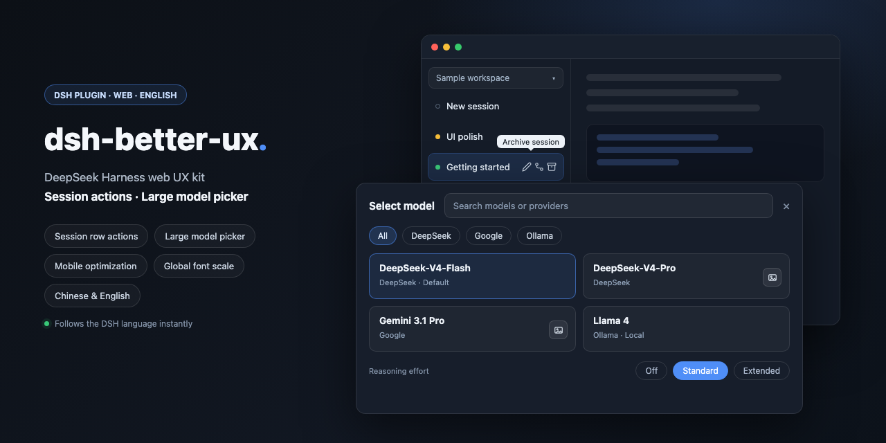

<div align="center">

<p>
  
</p>

# dsh-better-ux

**A focused DeepSeek Harness web UX kit for faster sessions, model selection, mobile navigation, and readable scaling.**

<p>
  <b>🇺🇸 English</b> | <a href="README.zh.md">🇨🇳 简体中文</a>
</p>

<p>
  <a href="https://github.com/deepseek-ai/deepseek-harness"></a>
  <a href="#install"></a>
  <a href="LICENSE"></a>
  <a href="package.json"></a>
</p>

<p>
  
</p>

</div>

A web UX kit for [DeepSeek Harness](https://github.com/deepseek-ai/deepseek-harness), with four independently configurable interface improvements:

- **Session row actions** — hover idle, running, or newly activated sessions to show Rename / Fork / Archive; keep `⋯` when another plugin adds menu actions
- **Model picker** — replace the cramped two-level menu with one overlay containing search, providers, reasoning levels, and Auto Vision twin actions on their original model cards
- **Mobile optimization** — hide the host sidebar on phones and tablets and render a custom horizontal bar; workspaces, sessions, status, overflow menus, view options, and sorting remain mapped to the host, with an added image picker
- **Global font scale** — set independent 10%–200% ratios for font size, line height, and padding on mobile (phone/tablet) and desktop/other viewports; mobile defaults to 80%, and step buttons change the value by 5%

All plugin-owned labels follow the current DSH language (Chinese or English) and update immediately when it changes. Mapped host actions reuse the host's localized labels where available. This release targets DSH builds with the built-in locale service.

### Model picker

One click opens a full overlay: search, provider chips, model cards, and reasoning levels on the bottom row. No nested “Model → list / Effort → list” menu. Providers stay on one horizontal rail; a normal mouse wheel or `Shift + wheel` scrolls it sideways, while independent `8px` fades indicate hidden content at either edge. If `dsh-vision-router` is loaded, Auto Vision twin providers are folded into their matching original model cards instead of appearing as duplicate groups: the card selects the original model, and its picture button selects the twin route.

| Enabled (top) · Disabled, original menu (bottom) |
| --- |
|  |
|  |

### Session row actions

Idle, running, and blank sessions that finish activation all receive Rename, Fork, and Archive shortcuts; hover an icon for its name. The plugin hides the native `⋯` only when all three shortcuts are enabled and the native menu contains exactly those three actions. Disabling any shortcut, an unrecognized menu, or extra actions contributed by another plugin keeps `⋯` available. This hiding rule is desktop-only and does not affect the mobile overflow menu.

| Enabled (top) · Disabled, original row (bottom) |
| --- |
|  |
|  |

### Mobile optimization

Under **Settings → Better UX**, phones and tablets hide the host sidebar and use the plugin's own top bar. The first row contains the logo, a conversation-header toggle, and native DSH actions for New session, New workspace, Search, View options, and Settings; the horizontal rows below show workspaces and sessions for the selected workspace.

**If you customized the original left sidebar heavily, consider turning this option off.**

- **Host mapping** — workspace/session selection, creation, search, Workspace/Flat grouping, Manual/Recently updated sorting, and overflow menus call host data and callbacks; selecting a workspace collapsed on desktop expands it without offering a mobile collapse action
- **Status and time** — each session uses one row ordered as status, title, time, and overflow action; approvals, plan reviews, and questions use a yellow dot, running keeps the host animated icon, completed-unread uses a green dot, and completed-read has no prefix
- **Adaptive title rows** — Chinese titles show up to `12` characters and English receives twice that budget before `...`; short titles shrink to their content, while workspace and session capsules stay at `260%` of the current text size
- **Conversation header** — a mobile-only button beside the logo smoothly collapses or expands the host conversation header; top action icons are `18px` while their touch targets remain larger
- **Long-press reorder** — long-press a workspace or session tab to pop up a small capsule beneath it with `‹` `›` buttons that nudge it one slot per tap; works in both Manual and Recently updated ordering (Recently updated still auto-bubbles recently updated sessions to the front)
- **No auto-focus on session switch** — on by default; switching sessions does not focus the composer input, so the touch keyboard does not jump up and cover the content you opened the conversation to check (such as a freshly generated code block); tap the field whenever you want to type
- **Horizontal overflow** — workspace and session rows support touch scrolling with independent `8px` fades on each edge of each row
- **Disable page pinch-zoom** — on by default, blocks two-finger pinch zooming so a stray second finger on mobile no longer warps the page into an odd zoom or broken layout; if you rely on system zoom, turn the option off and the gesture comes back
- **Flat list** — removes the workspace row and reduces both bar height and content offset
- **Add image** — an image button appears beside the command-plus button, supports multiple selection, and reuses the host paste-image validation, draft preview, removal, and send flow; ordinary file attachments are not currently supported by the host
- **Compatibility and restore** — the host conversation header and right-sidebar controls remain positioned below the dynamic bar; disabling the feature restores the original host sidebar and composer

| Enabled | Disabled, original layout |
| --- | --- |
|  |  |

Grouping follows the host view options: **By workspace** keeps the workspace rail above sessions, **Flat list** removes it and shortens the bar.

| Enabled | Disabled, original layout |
| --- | --- |
|  |  |

### Global font scale

Mobile (phone/tablet) and desktop/other ratios are stored separately. Enter any integer from `10` to `200`, or use the buttons for `5%` steps. Mobile defaults to `80%` and desktop to `100%`. Scaling follows each element's original font size and also adjusts explicit line height and padding; disabling the category or unloading the plugin restores the original inline styles.


### Settings

Open **Settings → Better UX**.


| Category | Configurable options |
| --- | --- |
| Session row actions | Master switch, Rename, Fork, Archive, hover tooltips |
| Model picker | Master switch, search, provider filter, reasoning levels, close on pick |
| Mobile optimization | Master switch, long-press reorder capsule, no auto-focus on session switch, horizontal overflow hints, right-sidebar compatibility, disable page pinch-zoom |
| Global font scale | Master switch, mobile ratio, desktop/other ratio |

Disabling a category restores the corresponding original DSH interface.

## Install

### npm

```bash
dsh plugin --profile web add dsh-better-ux@latest
```

### GitHub

```bash
dsh plugin --profile web add github:MitsukiJoe/dsh-better-ux
```

### Ask DSH

Send this message to DSH:

```text
Install this plugin https://github.com/MitsukiJoe/dsh-better-ux
```

Restart DSH after installation.

## Update

```bash
dsh plugin --profile web update dsh-better-ux
```

Or send this message to DSH:

```text
Update this plugin https://github.com/MitsukiJoe/dsh-better-ux
```

## Uninstall

Remove `dsh-better-ux` from `~/.dsh/profiles/web/package.json` (`dependencies` and `dsh.profile.bundles`), delete `node_modules/dsh-better-ux`, restart DSH.

Settings stay in `localStorage` under `dsh-better-ux:v1`.

## Notes

This is a dual-face plugin: host `apply()` is a no-op; the browser half is served at `/plugins/dsh-better-ux/client.js`.
