<div align="center">

<p>
  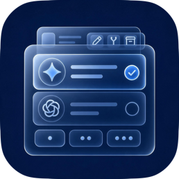
</p>

# dsh-better-ux

**面向 DeepSeek Harness 网页端的交互增强：会话操作、模型选择、移动端优化、字体缩放、已发消息导航、对话总结、上下文提醒与 DeepSeek 账号状态。**

<p>
  <a href="README.en.md">🇺🇸 English</a> | <b>🇨🇳 简体中文</b>
</p>

<p>
  <a href="https://github.com/deepseek-ai/deepseek-harness"></a>
  <a href="#安装"></a>
  <a href="LICENSE"></a>
  <a href="https://www.npmjs.com/package/dsh-better-ux"></a>
</p>

<p>
  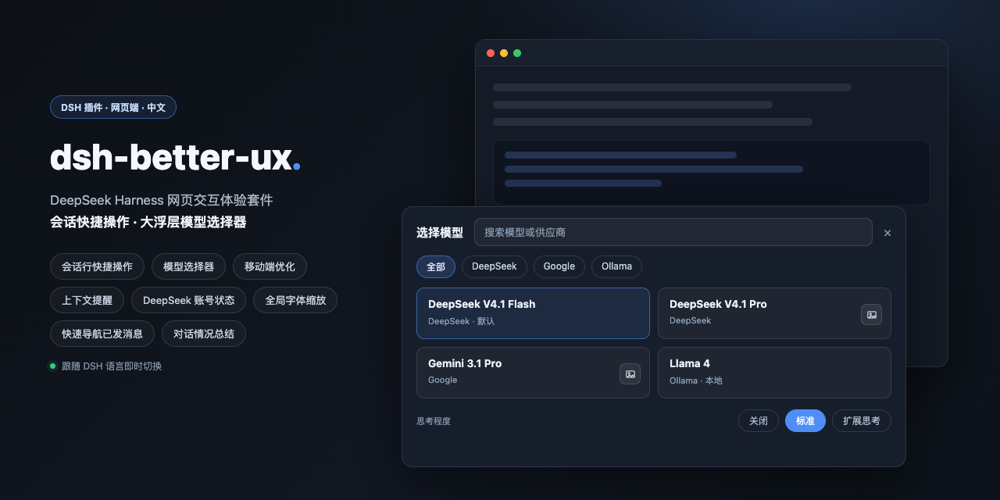
</p>

</div>

[DeepSeek Harness](https://github.com/deepseek-ai/deepseek-harness) 的网页交互体验套件，包含八类可独立开关的界面优化：

- **会话行快捷操作**：hover 普通、运行中或刚完成激活的会话，直接显示重命名 / 分叉图标；归档使用宿主自带按钮；原菜单有其他插件追加项时仍保留 `⋯`
- **模型选择器**：小两级菜单换成大浮层，搜索、供应商和思考档位集中显示，并把识图孪生入口合并到对应的原模型卡片
- **移动端优化**：手机和平板隐藏宿主左侧栏，使用自定义横向顶部栏；工作区、会话、状态、更多菜单、视图选项和排序仍映射宿主
- **上下文提醒**：hover 追加已用 / 总量，达到阈值时圆环变红，默认 90%
- **DeepSeek 账号状态**：输入框上方显示余额、峰谷、倒计时和输入 / 输出单价
- **全局字体缩放**：移动端（手机 / 平板）和桌面 / 其他可分别设置 10%–200% 的字体、行高和内边距比例会跟随调整，方便设置成看到更多内容；移动端默认 80%，步进按钮每次调整 5%
- **快速导航已发消息**：正文里两个浮动按钮直接跳到上一句 / 下一句我发送的消息，显示与隐藏跟随宿主的**回到底部**按钮
- **对话情况总结**：默认关闭，选好摘要模型后会话头部会出现**对话情况**面板，保存整个对话和最近任务两份摘要，本地缓存并通过插件自带的 Host 接口同步

插件自有文案会跟随 DSH 当前的中文或英文即时切换；映射宿主操作时，会优先复用宿主已经本地化的标签。本版本面向带有内置语言服务的 DSH。

### 模型选择器

点一次打开大浮层：搜索、供应商筛选、模型卡片，思考档位铺在底部。
不再走「模型 → 列表 / 推理等级 → 列表」两级菜单。
DeepSeek 账号和官方供应商置顶，其余供应商保持模型目录顺序。供应商筛选固定为单行横向轨道，普通滚轮和 `Shift + 滚轮` 都可横向浏览。
若装了 [dsh-vision-router](https://github.com/ysr666/dsh-vision-router) && [dsh-vision-router-inline](https://github.com/MitsukiJoe/dsh-vision-router-inline)
识图孪生供应商不会呈原插件那样重复显示为独立分组，而是合并到对应的原模型卡片：点卡片走原模型，点右侧图片按钮走识图路由。


| 上：插件开启 · 下：关闭插件（原版）                                    |
| ------------------------------------------------------ |
| 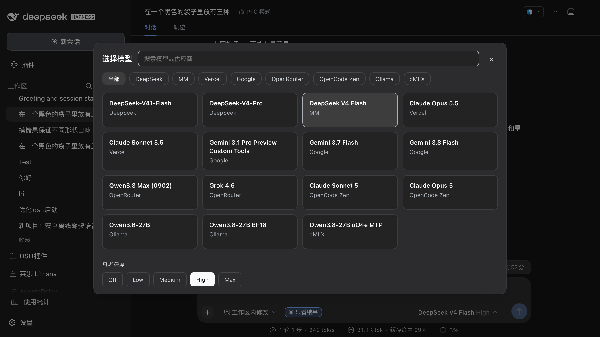         |
| 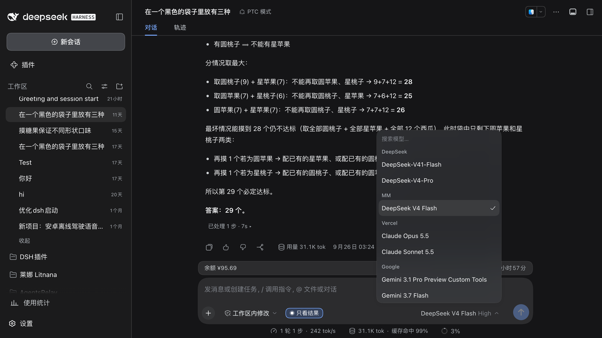 |


### 会话行快捷操作

会话重命名和分叉快捷按钮拿到外面来提高操作效率，hover 图标可显示功能名。归档使用宿主会话行自带的按钮。  
两个快捷项全部启用，且宿主 `⋯` 菜单严格只有这两项时，插件会隐藏重复的 `⋯`；  
若关闭任一快捷项、菜单无法识别，或其他插件追加了菜单项，则保留 `⋯`。  
该隐藏规则只用于桌面端，不影响移动端的更多菜单。


| 上：插件开启 · 下：关闭插件                                    |
| -------------------------------------------------- |
| 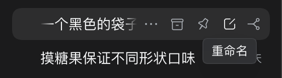         |
| 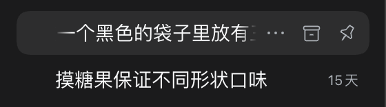 |


### 移动端优化

在 **设置 → 交互体验** 中开启后，手机和平板会隐藏宿主左侧栏，改用插件自有顶部栏：  
第一行显示 Logo、会话头部折叠按钮，以及使用 DSH 原生图标的新建对话、新建工作区、搜索、视图选项和设置；  
后续横向区域展示工作区及当前工作区的会话。

**如果您对原左侧栏自定义程度过高，建议关闭该选项。**

- **宿主映射**：工作区与会话切换、新建、搜索、按工作区 / 单列表、手动排序 / 最近更新和更多菜单均调用宿主数据与回调；选择桌面端已折叠的工作区时会自动展开，移动端不会反向收起
- **状态与时间**：会话以单行顺序显示状态、标题、时间和更多按钮；待批准 / 计划审阅 / 待回答显示黄点，运行中复用宿主动态图标，完成未读显示绿点，完成已读不显示前缀
- **自适应标题行**：中文标题最多显示 `12` 个字符，英文按双倍长度计算，超出后显示 `...`；短标题按内容收缩，工作区与会话胶囊高度始终为当前文字大小的 `260%`
- **会话头部**：Logo 右侧的移动端按钮可渐进收起或展开宿主会话头部；顶部操作图标统一为 `18px`，保留适合触控的按钮区域
- **长按调序**：长按工作区或会话标签，下方弹出带 `‹` `›` 箭头的胶囊，点按一次移动一位；手动排序和最近更新模式下都可用（最近更新模式下宿主仍会把最近更新的会话自动置前）
- **切换不自动聚焦**：默认开启，切换会话后不自动聚焦输入框，软键盘不会立刻弹出挡住你想看的内容（比如刚生成的代码块）；需要输入时再点输入框即可
- **横向溢出**：工作区与会话支持触屏横向滚动，每行分别使用左右 `8px` 渐变遮罩提示剩余内容
- **禁止双指缩放页面**：默认阻止双指捏合缩放整页，避免手机上第二根手指误触把页面缩放错位、排版变乱；习惯用系统缩放的人可以自行关闭该项，关闭后手势恢复
- **单列表**：隐藏工作区行并同步缩短顶部栏及主内容偏移
- **兼容与恢复**：宿主会话头部和右侧侧边栏按钮始终定位在动态顶部栏下方；关闭总开关后恢复宿主原版侧栏和输入区


| 插件开启 | 关闭插件（原版） |
| --- | --- |
| 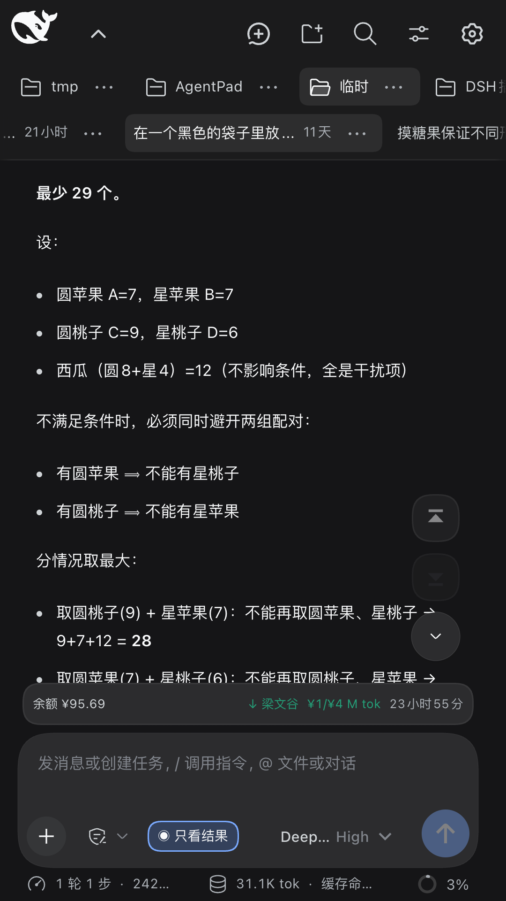 | 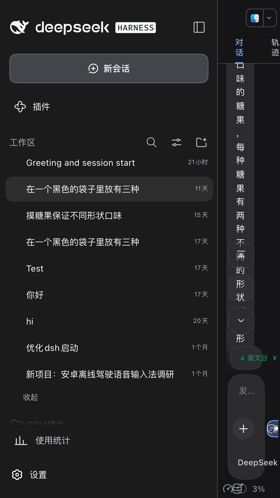 |


分组方式跟随宿主视图选项：**按工作区**保留会话上方的工作区轨道，**单列表**隐藏该行并缩短顶部栏。


| 插件开启 | 关闭插件（原版） |
| --- | --- |
| 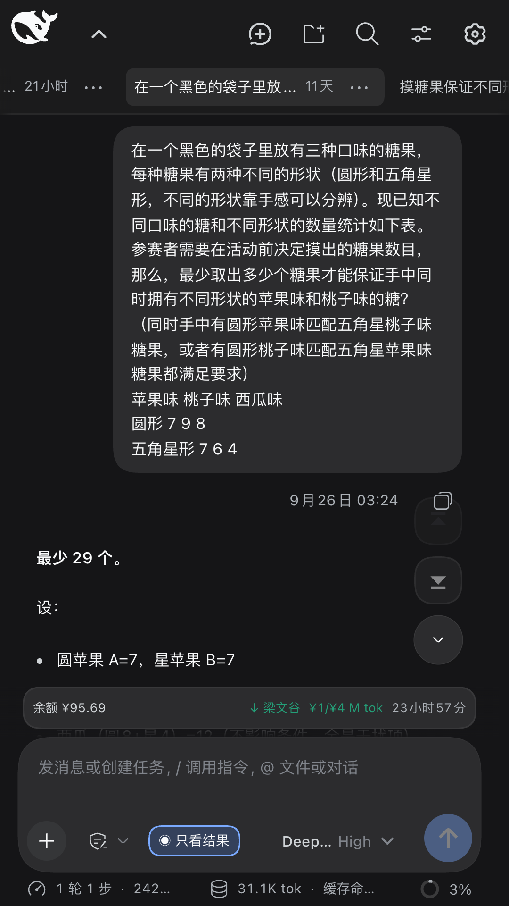 | 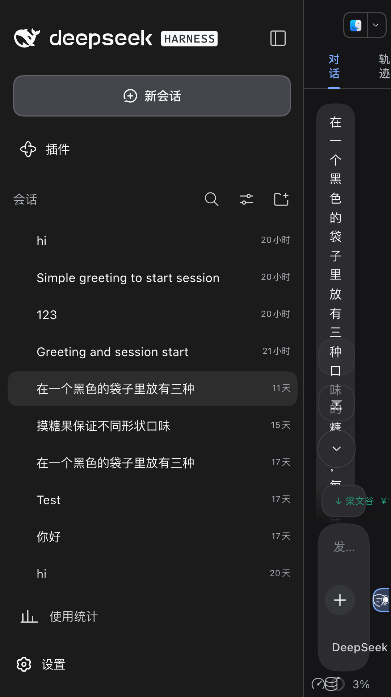 |

#### 模型名长度限制4字

位于 **设置 → 交互体验 → 移动端优化**，默认开启。手机 / 平板布局（视口宽度不超过 1023px）下，模型名最多显示前 4 个字符，超出后加 `…`；思维程度完整显示在同一行。兼容原生模型选择器和本插件选择器，关闭此项或移动端优化总开关后，立即恢复完整名称。

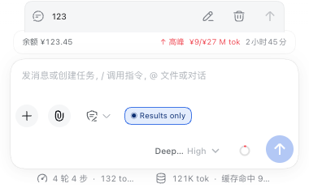

### 上下文提醒

默认开启。hover 上下文圆环时，在原有百分比下追加与原生详情一致的已用 / 总量（例如 `~291K / 1M`）。**红色提醒阈值**可设为 1–100 的整数，默认 `90%`；显示百分比达到阈值时，圆环变为红色，跟随「提示颜色」配色，默认暗色。点击后的原生详情内容保持不变，关闭后恢复原来的圆环和 hover。

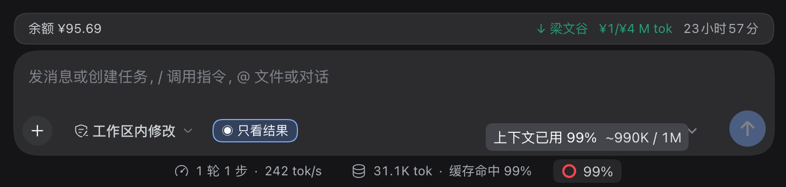

### DeepSeek 账号状态

默认开启，使用输入框上方的原生插槽，排队消息在状态栏上方，状态栏的显示层级高于排队框以避免重叠遮挡；余额靠左，右侧依次显示峰谷、输入 / 输出价格（`M tok`）、剩余小时 / 分钟。高峰为红色上箭头，低谷为绿色下箭头，价格同色，倒计时为灰色。关闭后移除栏位并停止余额请求。

**提示颜色**可切换「暗色 / 亮色」，默认暗色（原配色）；亮色使用红色 `#fe395d`、绿色 `#00d066`，同时控制上下文圆环、余额告警和峰谷价格。

**额度余额告警**默认 `5.00`，余额严格低于该金额时显示红色，单位跟随余额币种。**峰谷整活显示**默认开启，以整活文案显示峰谷状态，关闭后立即恢复常规显示。

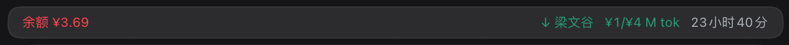

余额由 Host 使用官方 DeepSeek 供应商凭据独立调用 [官方余额接口](https://api-docs.deepseek.com/api/get-user-balance/)，密钥不会返回浏览器。余额全局共享，切换会话不会清空或触发查询；可见页面约每分钟刷新，隐藏页面暂停；Host 对同账号缓存 60 秒并合并并发请求。缺少官方凭据或查询失败只改变左侧提示，右侧峰谷、价格和倒计时继续显示。升级后需重启 DSH Web 加载新的 Host 接口。

峰谷指**官方计费时段**，不是实时服务拥堵程度。[价格规则](https://api-docs.deepseek.com/zh-cn/quick_start/pricing/)核对于 2026-10-06：北京时间周一至周五 09:00–12:00、14:00–18:00 为高峰，中国公共假期除外；其余为低谷。单价为每百万 token 的**未命中缓存输入 / 输出**，币种跟随返回余额（失败时保留已知币种）。选择官方 Flash / Pro 时更新价格；切到第三方时沿用上次官方模型，首次默认 Flash。价格和 2026 年官方节假日日历均为插件内置规则，不会自动从官网获取更新；官方调整规则或跨年时需更新插件，实际计费以官网为准。未知年度不展示未经核实的峰谷价格。

### 全局字体缩放

手机 / 平板与桌面 / 其他分别保存缩放比例。输入框可直接填写 `10`–`200` 的整数，左右按钮以 `5%` 步进；移动端默认 `80%`，桌面默认 `100%`。  
缩放会按元素原始尺寸同步调整字体、明确的行高和内边距，关闭总开关或卸载插件后恢复原始样式。

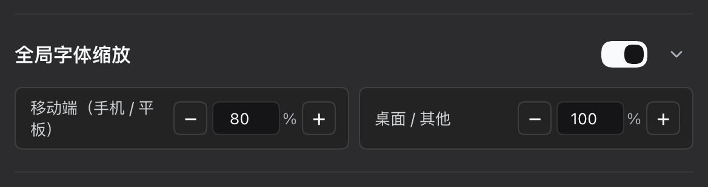

### 快速导航已发消息

正文列右下角纵向排列两个按钮，点一下跳到上一句或下一句我发送的消息，中间大段工具输出和回复不用再手动滚。显示状态跟随宿主的**回到底部**按钮：宿主隐藏时按钮一起隐藏，且不可点击、不可聚焦。桌面端静置为 50% 透明度，hover 或键盘聚焦后不透明；触屏端始终不透明。该方向没有消息时对应按钮置灰。

开启**到顶部时自动加载更早消息**后，滚到顶部再点上一条会触发宿主自己的分页控件一次，加载完成再跳到那条消息。这个等待有上界：如果这次加载始终没有出现更早的我的消息，10 秒后放弃，不会在更晚的时候突然移动视口。关掉该选项则只在已加载的消息之间跳转。


### 对话情况总结

默认关闭，因为要先有模型：选好摘要模型再打开总开关。会话头部会出现**对话情况**面板，为当前会话保存两份由模型生成的摘要——**整个对话**和**最近任务**。

- **模型**：从宿主模型目录里任选供应商和模型，模型有推理档位时可一并选择。对话内容会发给你选的这个模型，所以请挑一个你愿意把该会话发过去的模型。
- **要求**：两个输入框都可选。留空时分别使用「400 个字以内简明扼要总结当前 session 干了什么」和「100 个字以内简明扼要总结这轮对话干了什么」；这两个字数只属于默认提示词，不会对返回内容做截断。句号后换行这条格式规则固定生效，不可覆盖。
- **展示方式**：**大卡片**以正文列为基准显示在内容上方，**小卡片**在空间充足时显示左侧面板、不足时自适应降级为小球，**折叠**始终只显示小球。小球可设置悬停展开、点击展开，或两者都开。
- **快捷键**：折叠 / 展开摘要正文，默认 `Tab`。在设置页点击该输入框后按下任意非纯修饰键组合即可重绑，右侧 `X` 清空。在输入框和可编辑内容里，Tab 保持原生行为。
- **持久化**：摘要缓存在 `localStorage`，并通过插件自带的 Host 接口同步，因此刷新不丢，同一个 DSH Host 下的不同浏览器和设备共享同一份。归档会话会删除对应摘要。每次生成的 token 用量显示在面板里。

这一类需要插件的 host 半边已加载。如果正在运行的 Host 版本旧于浏览器半边，面板会直接提示，需要重启 DSH Web。

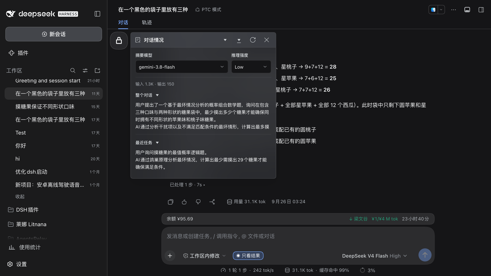

### 设置

入口为 **设置 → 交互体验**。可配置：

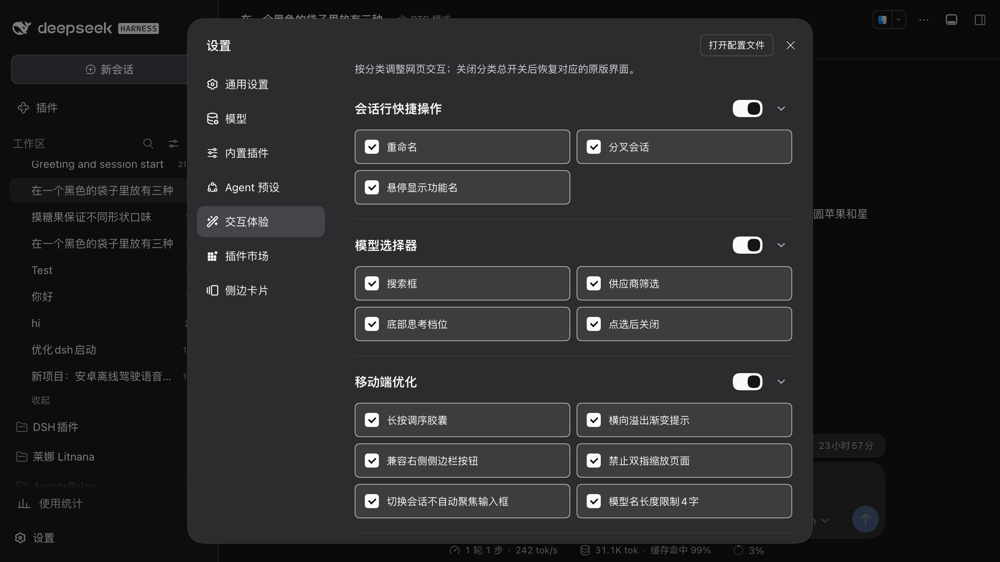

- **会话行快捷操作**：总开关、重命名、分叉、悬停功能名
- **模型选择器**：总开关、搜索框、供应商筛选、底部思考档位、点选后关闭
- **移动端优化**：总开关、长按调序胶囊、切换会话不自动聚焦、横向溢出提示、右侧侧边栏兼容、禁止双指缩放页面、模型名长度限制4字
- **上下文提醒**：总开关、红色提醒阈值（默认 90%）
- **DeepSeek 账号状态**：总开关、提示颜色（暗色 / 亮色）、额度余额告警、峰谷整活显示
- **全局字体缩放**：总开关、移动端比例、桌面 / 其他比例
- **快速导航已发消息**：总开关、到顶部时自动加载更早消息
- **对话情况总结**：总开关、整个对话、最近任务、摘要模型与推理强度、展示方式、折叠正文快捷键、两个要求输入框、小球悬停 / 点击展开

关闭分类总开关会恢复对应的 DSH 原版界面。

插件设置、会话头部及摘要折叠状态、工作区分组与排序（`groupBy` / `orderBy`）通过同一个 DSH Host 在浏览器和设备之间共享；不同 Host 安装不互通。`localStorage` 仍作为即时缓存。

## 运行要求

需要 Node.js 22 或更高版本，以及提供语言服务、插槽（slots）、模型目录、存储和宿主鉴权能力的 DSH Web。文档与界面核对于 2026-10-07，使用 DSH `0.2.0-rc.2`；其他版本需确认上述能力可用。功能截图统一使用深色主题和现有模型目录；含对话内容的截图均来自「临时」工作区中标题以「在一个黑色的袋子里放有三种」开头的真实会话，保留原始正文。摘要直接展示该会话已有缓存，以左上角小球展开的完整桌面窗口展示。桌面以 1280×720 CSS 像素、DPR 2 拍摄；手机以 360×640 DP、DPR 3 拍摄，完整截图输出为 1080×1920 像素。模型选择器展示完整桌面窗口，移动端展示完整展开界面；字体缩放仅展示设置，设置总览保留完整窗口外框、左侧入口及正常展开的分类。99% 上下文与 ¥3.69 余额仅在真实 DOM 中演示；余额告警阈值保持默认 5.00，原生轮数、步数、速度、token 和缓存统计保留。

Host 负责保存设置与摘要、鉴权查询 DeepSeek 余额；浏览器端提供界面增强。

## 安装

### GitHub

```bash
dsh plugin --profile web add github:MitsukiJoe/dsh-better-ux
```

### 一键安装

需要已有 web profile，以及 Git 和 Python 3；默认克隆到 `$HOME/dsh-better-ux` 并链接到 web profile。

```bash
curl -fsSL https://raw.githubusercontent.com/MitsukiJoe/dsh-better-ux/main/install.sh | bash
```

### 本地开发

在 `~/.dsh/profiles/web/package.json` 的 `dependencies` 中将 `dsh-better-ux` 设为 `file:/绝对路径/dsh-better-ux`，并在 `dsh.profile.bundles` 数组加入 `dsh-better-ux`。以源码位于 `$HOME/dsh-better-ux` 为例：

```bash
mkdir -p "$HOME/.dsh/profiles/web/node_modules"
ln -sfn "$HOME/dsh-better-ux" "$HOME/.dsh/profiles/web/node_modules/dsh-better-ux"
```

### npm

```bash
dsh plugin --profile web add dsh-better-ux@latest
```

### 让 DSH 安装

向 DSH 发送：

```text
安装这个插件 https://github.com/MitsukiJoe/dsh-better-ux
```

安装后重启 DSH Web。

## 更新

```bash
dsh plugin --profile web update dsh-better-ux
```

或向 DSH 发送：

```text
更新这个插件 https://github.com/MitsukiJoe/dsh-better-ux
```

更新后重启 DSH Web，加载 Host 侧更新。

## 卸载

从 `~/.dsh/profiles/web/package.json` 的 `dependencies` 和 `dsh.profile.bundles` 中都移除 `dsh-better-ux`，删除 `~/.dsh/profiles/web/node_modules/dsh-better-ux`，重启 DSH Web。

卸载会保留浏览器 `localStorage` 中的设置（`dsh-better-ux:v1`）和摘要缓存，以及 Host 保存的设置和摘要。
