<div align="center">

<p>
  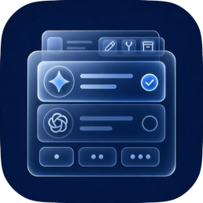
</p>

# dsh-better-ux

**面向 DeepSeek Harness 网页端的交互增强：会话操作、模型选择、移动导航、照片上传与字体缩放。**

<p>
  <a href="README.md">🇺🇸 English</a> | <b>🇨🇳 简体中文</b>
</p>

<p>
  <a href="https://github.com/deepseek-ai/deepseek-harness"></a>
  <a href="#安装"></a>
  <a href="LICENSE"></a>
  <a href="package.json"></a>
</p>

<p>
  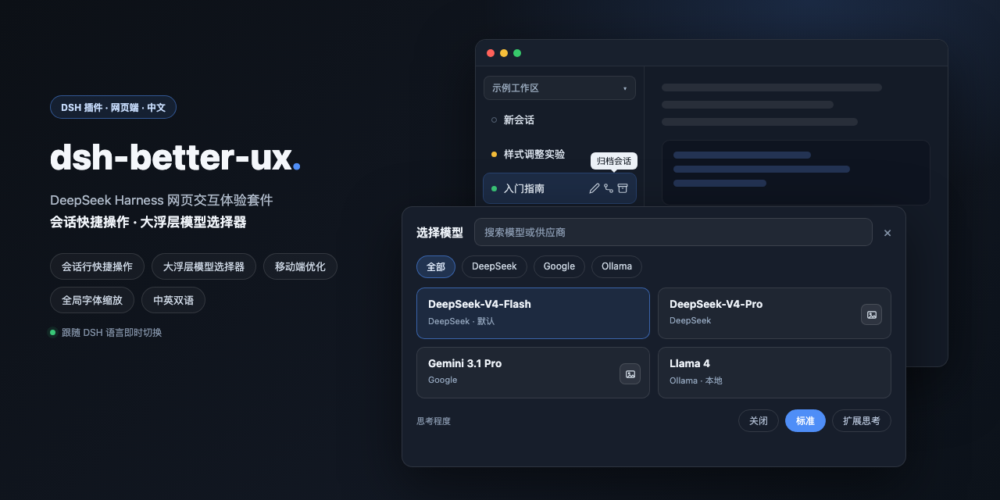
</p>

</div>

[DeepSeek Harness](https://github.com/deepseek-ai/deepseek-harness) 的网页交互体验套件，包含四类可独立开关的界面优化：

- **会话行快捷操作**：hover 普通、运行中或刚完成激活的会话，直接显示重命名 / 分叉 / 归档图标；原菜单有其他插件追加项时仍保留 `⋯`
- **模型选择器**：小两级菜单换成大浮层，搜索、供应商和思考档位集中显示，并把识图孪生入口合并到对应的原模型卡片
- **移动端优化**：手机和平板隐藏宿主左侧栏，使用自定义横向顶部栏；工作区、会话、状态、更多菜单、视图选项和排序仍映射宿主。原版移动端输入区没有照片入口，插件会在命令加号旁补上添加图片按钮
- **全局字体缩放**：移动端（手机 / 平板）和桌面 / 其他可分别设置 10%–200% 的字体、行高和内边距比例会跟随调整，方便设置成看到更多内容；移动端默认 80%，步进按钮每次调整 5%

插件自有文案会跟随 DSH 当前的中文或英文即时切换；映射宿主操作时，会优先复用宿主已经本地化的标签。本版本面向带有内置语言服务的 DSH。

### 模型选择器

点一次打开大浮层：搜索、供应商筛选、模型卡片，思考档位铺在底部。
不再走「模型 → 列表 / 推理等级 → 列表」两级菜单。
供应商筛选固定为单行横向轨道，普通滚轮和 `Shift + 滚轮` 都可横向浏览。
若装了 [dsh-vision-router](https://github.com/ysr666/dsh-vision-router) && [dsh-vision-router-inline](https://github.com/MitsukiJoe/dsh-vision-router-inline)
识图孪生供应商不会呈原插件那样重复显示为独立分组，而是合并到对应的原模型卡片：点卡片走原模型，点右侧图片按钮走识图路由。


| 上：插件开启 · 下：关闭插件（原版）                                    |
| ------------------------------------------------------ |
| 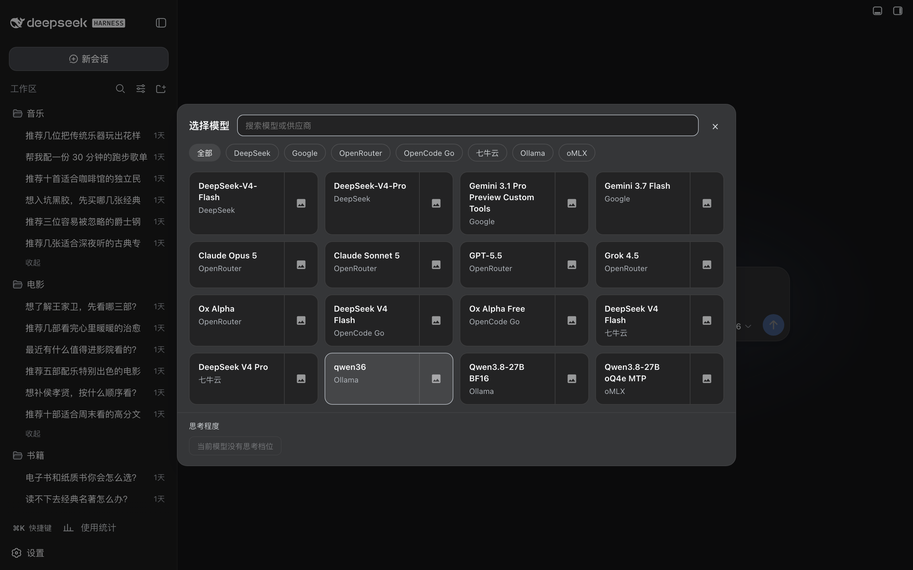         |
| 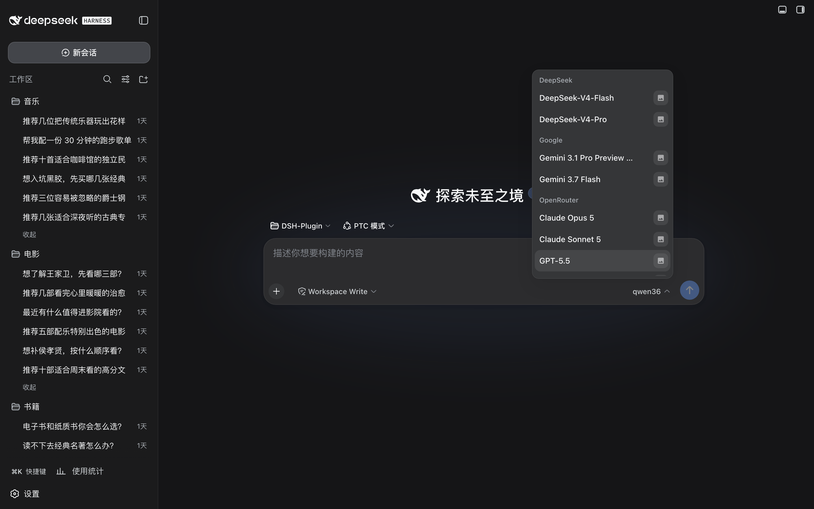 |


### 会话行快捷操作

会话重命名、分叉和归档快捷按钮拿到外面来提高操作效率，hover 图标可显示功能名。  
三个快捷项全部启用，且宿主 `⋯` 菜单严格只有这三项时，插件会隐藏重复的 `⋯`；  
若关闭任一快捷项、菜单无法识别，或其他插件追加了菜单项，则保留 `⋯`。  
该隐藏规则只用于桌面端，不影响移动端的更多菜单。


| 上：插件开启 · 下：关闭插件                                    |
| -------------------------------------------------- |
| 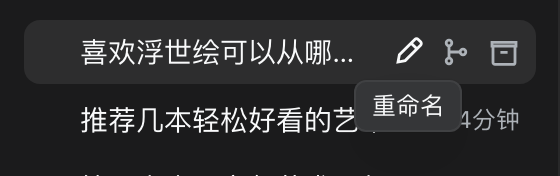         |
| 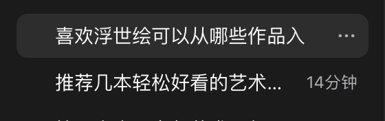 |


### 移动端优化

在 **设置 → 交互体验** 中开启后，手机和平板会隐藏宿主左侧栏，改用插件自有顶部栏：  
第一行显示 Logo、会话头部折叠按钮，以及使用 DSH 原生图标的新建对话、新建工作区、搜索、视图选项和设置；  
后续横向区域展示工作区及当前工作区的会话。

**如果您对原左侧栏自定义程度过高，建议关闭该选项。**

- **宿主映射**：工作区与会话切换、新建、搜索、按工作区 / 单列表、手动排序 / 最近更新和更多菜单均调用宿主数据与回调；选择桌面端已折叠的工作区时会自动展开，移动端不会反向收起
- **状态与时间**：会话以单行顺序显示状态、标题、时间和更多按钮；待批准 / 计划审阅 / 待回答显示黄点，运行中复用宿主动态图标，完成未读显示绿点，完成已读不显示前缀
- **自适应标题行**：中文标题最多显示 `12` 个字符，英文按双倍长度计算，超出后显示 `...`；短标题按内容收缩，工作区与会话胶囊高度始终为当前文字大小的 `260%`
- **会话头部**：Logo 右侧的移动端按钮可渐进收起或展开宿主会话头部；顶部操作图标统一为 `18px`，保留适合触控的按钮区域
- **长按调序**：长按工作区或会话标签，下方弹出带 `‹` `›` 箭头的胶囊，点按一次移动一位；手动排序和最近更新模式下都可用（最近更新模式下宿主仍会把最近更新的会话自动置前）
- **切换不自动聚焦**：默认开启，切换会话后不自动聚焦输入框，软键盘不会立刻弹出挡住你想看的内容（比如刚生成的代码块）；需要输入时再点输入框即可
- **横向溢出**：工作区与会话支持触屏横向滚动，每行分别使用左右 `8px` 渐变遮罩提示剩余内容
- **禁止双指缩放页面**：默认阻止双指捏合缩放整页，避免手机上第二根手指误触把页面缩放错位、排版变乱；习惯用系统缩放的人可以自行关闭该项，关闭后手势恢复
- **单列表**：隐藏工作区行并同步缩短顶部栏及主内容偏移
- **添加图片**：原版移动端网页输入区只有命令加号，没有独立的照片选择入口；插件在加号右侧补上图片按钮，支持多选并复用宿主粘贴图片的校验、草稿预览、删除和发送流程；宿主当前不支持普通文件附件
- **兼容与恢复**：宿主会话头部和右侧侧边栏按钮始终定位在动态顶部栏下方；关闭总开关后恢复宿主原版侧栏和输入区


| 插件开启                                      | 关闭插件（原版）                                          |
| ----------------------------------------- | ------------------------------------------------- |
| 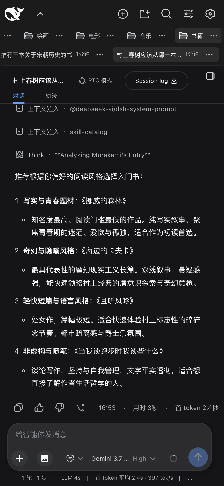 | 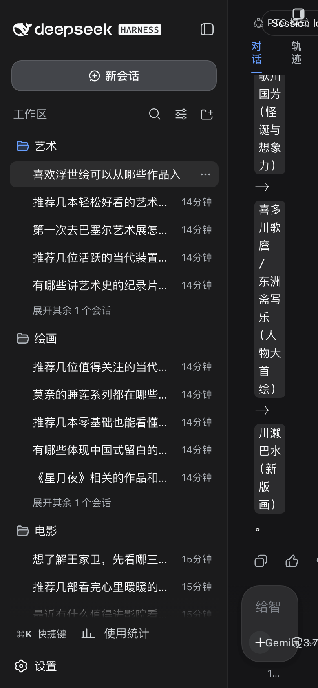 |


分组方式跟随宿主视图选项：**按工作区**保留会话上方的工作区轨道，**单列表**隐藏该行并缩短顶部栏。


| 插件开启                                | 关闭插件（原版）                                        |
| ----------------------------------- | ----------------------------------------------- |
| 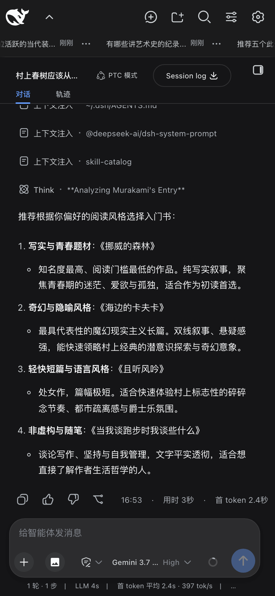 | 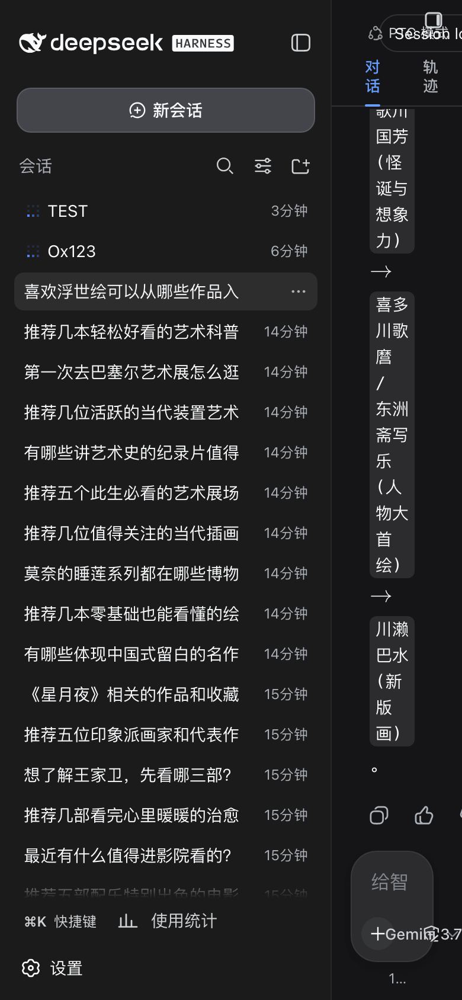 |

原版移动端输入区没有独立的照片按钮。开启移动端优化后，加号旁会多出一个添加图片入口：

| 插件开启 | 关闭插件（原版输入区） |
| --- | --- |
| 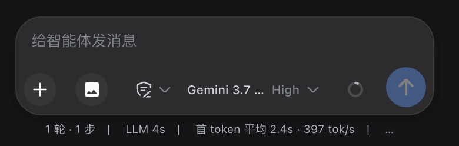 | 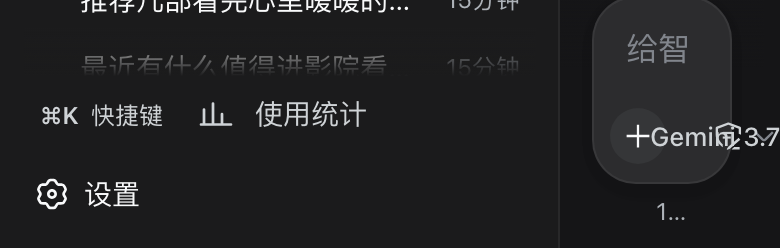 |


### 全局字体缩放

手机 / 平板与桌面 / 其他分别保存缩放比例。输入框可直接填写 `10`–`200` 的整数，左右按钮以 `5%` 步进；移动端默认 `80%`，桌面默认 `100%`。  
缩放会按元素原始尺寸同步调整字体、明确的行高和内边距，关闭总开关或卸载插件后恢复原始样式。

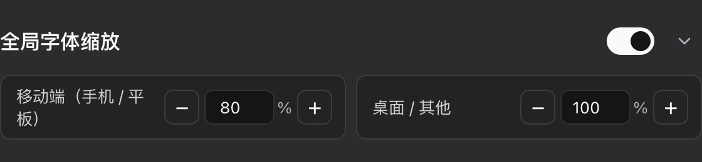

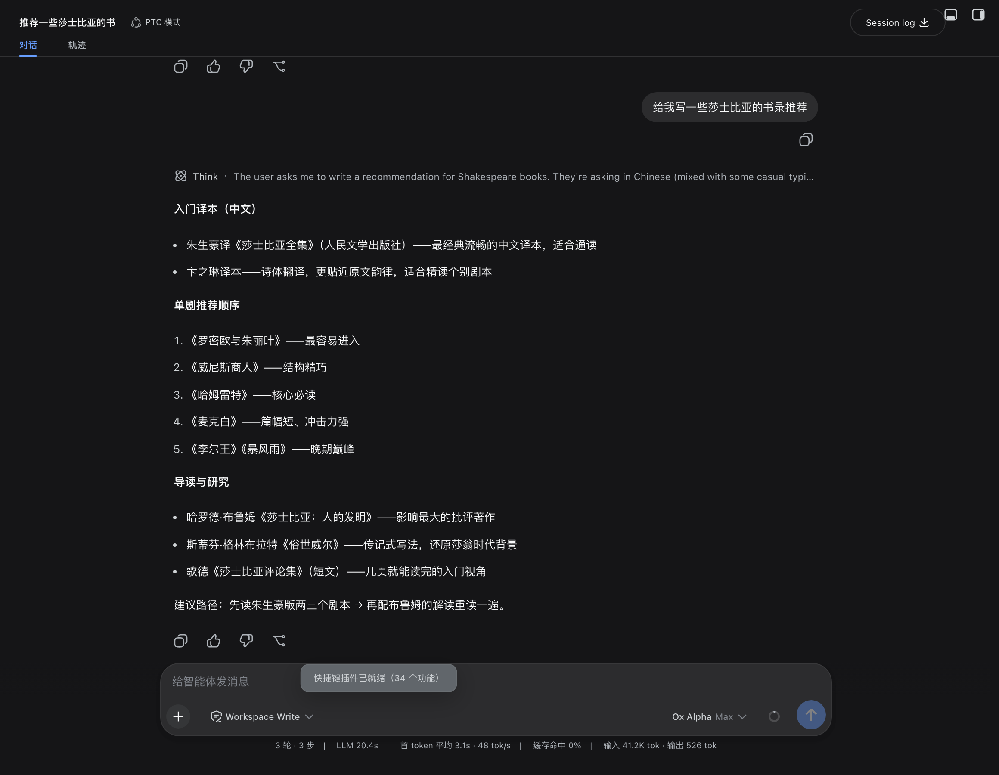

### 设置

入口为 **设置 → 交互体验**。可配置：

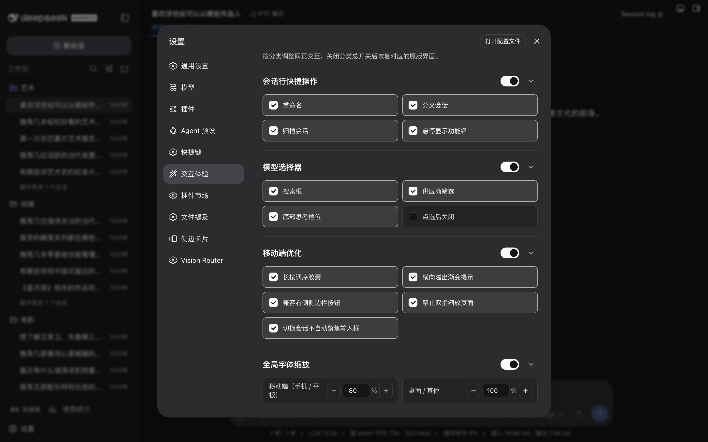

- **会话行快捷操作**：总开关、重命名、分叉、归档、悬停功能名
- **模型选择器**：总开关、搜索框、供应商筛选、底部思考档位、点选后关闭
- **移动端优化**：总开关、长按调序胶囊、切换会话不自动聚焦、横向溢出提示、右侧侧边栏兼容、禁止双指缩放页面
- **全局字体缩放**：总开关、移动端比例、桌面 / 其他比例

关闭分类总开关会恢复对应的 DSH 原版界面。

## 安装

### npm

```bash
dsh plugin --profile web add dsh-better-ux@latest
```

### GitHub

```bash
dsh plugin --profile web add github:MitsukiJoe/dsh-better-ux
```

### 让 DSH 安装

向 DSH 发送：

```text
安装这个插件 https://github.com/MitsukiJoe/dsh-better-ux
```

安装后重启 DSH。

## 更新

```bash
dsh plugin --profile web update dsh-better-ux
```

或向 DSH 发送：

```text
更新这个插件 https://github.com/MitsukiJoe/dsh-better-ux
```

## 卸载

从 `~/.dsh/profiles/web/package.json` 去掉 `dsh-better-ux`，删掉 `node_modules/dsh-better-ux`，重启。

配置留在 `localStorage` 的 `dsh-better-ux:v1`。